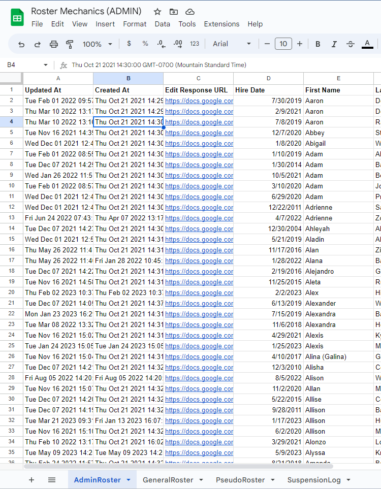
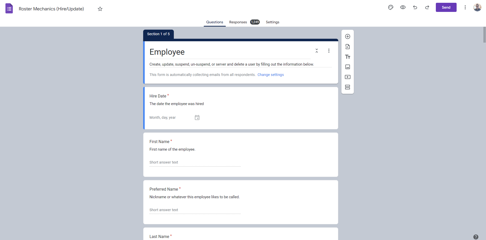
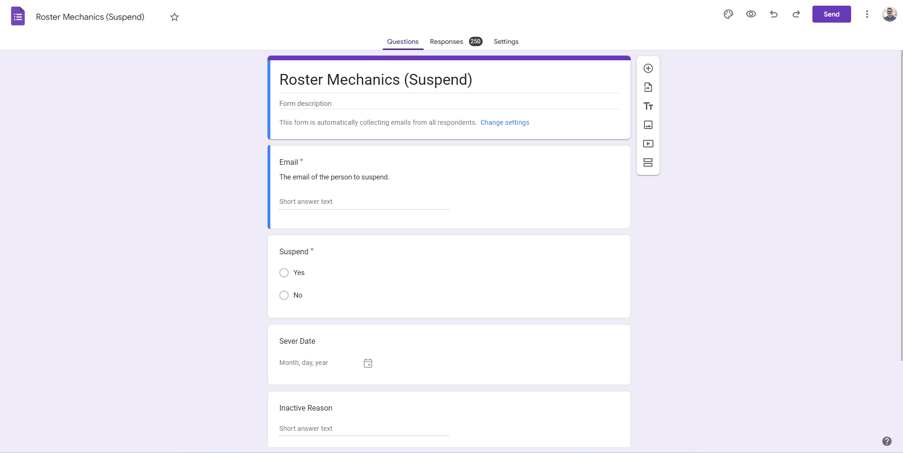
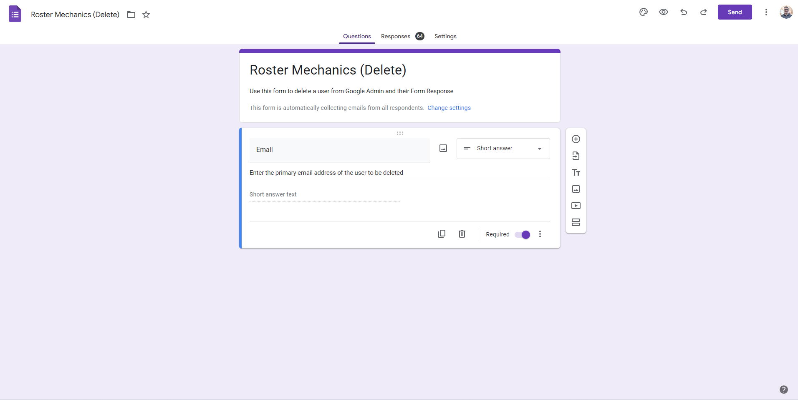
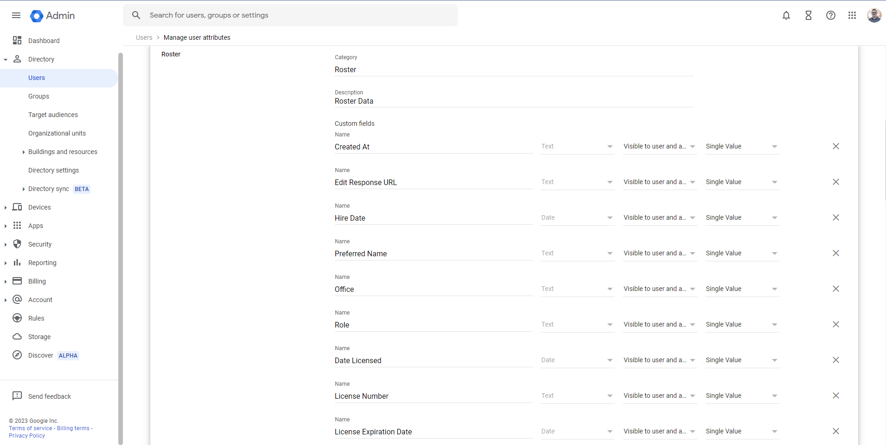

# Roster Mechanics

A Russ Lyon Sotheby's International Realty Google Apps Script project to manage employees and maintain a company roster.

  <p align="center">
  <a href="" rel="noopener">
 </a>
  <a href="" rel="noopener">
 </a>
 </p>

## Table of Contents

- [Roster Mechanics](#roster-mechanics)
  - [Table of Contents](#table-of-contents)
  - [About](#about)
  - [Prerequisites](#prerequisites)
  - [Sheets](#sheets)
  - [Forms](#forms)
    - [Hire Update Form](#hire-update-form)
    - [Suspend Form](#suspend-form)
    - [Delete Form](#delete-form)
  - [Custom Schema](#custom-schema)
  - [Install](#install)
  - [Build](#build)
  - [Push](#push)
  - [Build And Push In a Single Step](#build-and-push-in-a-single-step)
  - [Testing](#testing)

This repo is a [Google Apps Script](https://developers.google.com/apps-script) project that produces a company roster in a [Google Spreadsheet](https://www.google.com/sheets/about/) where all the data is stored safely in [Google Admin](https://admin.google.com/) and made editable by links to [Google Form](https://www.google.com/forms/about/) responses within the Spreadsheet itself. All the data in the Spreadsheet is stored in Google Admin via the default data structures provided (name, organization, phone, etc.), as well as defined [custom schema fields](https://developers.google.com/admin-sdk/directory/v1/guides/manage-schemas).

The repo is written entirely in [Typescript](https://www.typescriptlang.org/) and uses [webpack](https://webpack.js.org/) to transpile it into something that is understable by the Google Apps Script V8 runtime. While the project doesn't have any runtime dependencies (which increases the run speed and makes life in Google Apps Script land less complicated), you can add runtime dependencies that will get wrapped into the bundle on build and run just fine. Though I will say, if you add a runtime dependency, you should make sure that the Google Apps Script V8 runtime provides the necessary environment to run the package nontheless. There are on the other hand, many compile-time (development) dependencies that help to lint, format, build, and deploy the code.

Tests for the project are all completely locally run via [Jest](https://jestjs.io/). You may wonder how it is that a Google Apps Script project can be tested locally? I accomplished this by writing mock implementations for MANY of the Google Apps Script's runtime classes (for example: [UrlFetchApp](https://developers.google.com/apps-script/reference/url-fetch/url-fetch-app), [SpreadsheetApp](https://developers.google.com/apps-script/reference/spreadsheet/spreadsheet-app), [FormApp](https://developers.google.com/apps-script/reference/forms/form-app), [DriveApp](https://developers.google.com/apps-script/reference/drive/drive-app), [GmailApp](https://developers.google.com/apps-script/reference/gmail/gmail-app), and MANY MANY more). While this isn't a perfect way of testing, it does do the job for the most part. Being that it isn't perfect, I set the project up to run in two different environments: a development/testing environemnt, and a production environment. The instructions for setting up both are below. That way, you can deploy to a testing environment first to work out any bugs that local testing might not have caught before deploying to the production environment.

## About

This project was born out of a need. We had a company roster stored in a Goolge Sheet, but that Google Sheet had problems. For starters, anyone with access to the spreadsheet could edit it. This was a problem for many reasons. For example, people could and would accidently delete things. Secondly, the data in the Spreadsheet was not backup up, ever. Another problem with the sheet were the values themselves. They weren't formatted the same. Maybe for the value "No" some people would write "no" or "NO." Another glaring problem is that simply entering a new employee in the Google Sheet didn't actually create a new Google User account, or create their user signature, or all the other actions invovled in setting up a new User for Google Workspace. We needed a way for administrative office staff to be able to create, update, suspend, and delete employees on the roster, without them actually having admin access to Google Admin / Google Workspace. To fix these problems and more, I created the project "Roster Mechanics." Here is the workflow:

1. The "Hire Update" Google form is filled out for a new employee
2. The script associated with the "Hire Update" form runs on the event "Form Submit"
3. The script does a ton of things, such as creating a new Google User account and sets it up with all the bells and whisltes. All the data filled into the form is stored into the Google User Account's custom schema fields. The last thing the script does is tell the Google Sheet script to run.
4. Next, the Google Sheet associated with the Roster runs it's associated script on the event "Spreadsheet Open", on a regular interval, as well as being triggered at the end of all the Google Form submissions.
5. The Google Sheet script grabs all users from Google Admin / Google Workspace, as well as their custom schema fields containing the information from the "Hire Update" form, and prints them to their associated sheet in the Workbook
6. At this point, the company roster is neatly printed in a Google Sheet and all the data within backed up in Google Admin / Google Workspace
7. When an employee needs to be edited, you find them in the sheet, specifically the column "Edit Response Url"
8. You follow the link to the orignal form response, edit the response, submit it again, and the process begins all over
9. When an Employee needs to be Suspended, you locate the "Suspend" Google Form, fill it out, and submit it.
10. The script associated with the "Suspend" Google Form runs. It suspends the user, as well as updating information on the Google User account such as the reason, time, and date of the suspension.
11. The Google Sheet script is again triggered to run. It updates the Google Sheet to reflect the newly suspended user.
12. When a user needs to be deleted, you located the "Delete" Google Form, fill it out, and submit it.
13. The script associated witht the "Delete" Google form runs. It deletes the user entirely.
14. Once again, the Google Sheet script is triggered to run. It updates the Google Sheet by removing the deleted user.

The problems this fixes are many. Firstly, all the data in the spreadsheet is stored and retireved from Google Admin. You could essentially delete the entire spreadsheet and it wouldn't be a problem. The next time the Google Sheet script runs, the spreadsheet will be restored to new. Secondly, all the data entry is proxied through Google Forms. In the Google Form, you can validate the data being entered. You can also make sure if responses need to be certain values or certain formats, that they are. Thirdly, the Google Form and the Google Sheet are subject to Authentication and Authorizaton. You can have viewers of the Spreadsheet, who can't edit the data because they don't have access to the Google Form. This helps limit who can see, create, update, suspend, and delete users.

## Prerequisites

In order to run this repo...

<ol>
  <li>Make sure you're running at least <a href="https://nodejs.org/en/download/"><i><b>Node.js</b></i></a> >= v18.16.0 and <i><b>npm</b></i> >= v9.6.5.</li>
  <li>You'll need to enable the Google Apps Script API. You can do that by visiting <a href="https://script.google.com/home/usersettings">script.google.com/home/usersettings</a></li>
  <li><a href="https://github.com/google/clasp#deployments"><i><b>google clasp</b></i></a> installed</li>
  <li>A <i><b>.env</b></i> file with all the values filled out from the <i><b>.env.example</b></i> file</li>
  <li>You will need a company config in the directory <i><b>src/config/company</b></i> named <i><b>russ-lyon.ts</b></i> based on the sample config found at <i><b>src/config/company/sample-company.ts</b></i></li>
  <li>You will need a company config in the directory <i><b>src/config/company</b></i> named <i><b>russ-lyon.ts</b></i> based on the sample config found at <i><b>src/config/company/sample-company.ts</b></i>
    <ul>
      <li>OR you will need to replace all imports such as <i><b>import RussLyonConfig from 'src/config/company/russ-lyon.ts'</b></i> with your own company config</li>
    </ul>
  </li>
  <li>2 Google Sheets. One is for development environment, the other is for the production environment
    <ul>
      <li>See the <a href="#sheets">Sheets Section</a> For more information</li>
    </ul>
  </li>
  <li>
    You'll need 6 Google Forms Total. 3 will be for the Development Environment, and the 3 other are for the Production Envionrment.
    <ul>
      <li>See the <a href="#forms">Form Section</a> for more information</li>
    </ul>
  </li>
  <li>You need custom schema values defined in Google admin
    <ul>
      <li>See the <a href="#custom-schema">Custom Schema Section</a> for more information</li>
    </ul>
  </li>
</ol>

## Sheets

You will need 2 Google Sheets.

One Google Sheet is for the development environment, the other is for the testing environment.

Both Google Sheets will need four named sheets within:

<ol>
<li>One named "AdminRoster"</li>
<li>One named "GeneralRoster"</li>
<li>One named "PseudoRoster"</li>
<li>One named "SuspensionLog"</li>
</ol>

See Screenshot: 

## Forms

There are 6 Google Forms needed.

Technically, there is only 3 unique forms.

The 3 forms from the development environment are the same as the 3 forms in the production environment.

The Forms are as follows:

<ul>
  <li><b>Testing - Hire Update</b>
    <ul>
      <li>For creating and updating users in the testing/development environment</li>
    </ul>
  </li>
  <li><b>Testing - Suspened</b>
    <ul>
      <li>For suspending users in the testing/development environment</li>
    </ul>
  </li>
  <li><b>Testing - Delete</b>
    <ul>
      <li>For deleting users in the testing/development environment</li>
    </ul>
  </li>
  <li><b>Production - Hire Update</b>
    <ul>
      <li>For creating and updating users in the production environment</li>
    </ul>
  </li>
  <li><b>Production - Suspend</b>
    <ul>
      <li>For suspending users in the production environment</li>
    </ul>
  </li>
  <li><b>Production - Delete</b>
    <ul>
      <li>For deleting users in the production environment</li>
    </ul>
  </li>
</ul>

#### Hire Update Form

<p>See Screenshot:

</p>
<p>You will need these questions in the form, with these EXACT titles, question types, and answers:</p>
<ul>
  <li><b>Hire Date</b>
    <ul>
      <li>Date</li>
    </ul>
  </li>
  <li><b>First Name</b>
    <ul>
      <li>Short Answer</li>
    </ul>
  </li>
  <li><b>Preferred Name</b>
    <ul>
      <li>Short Answer</li>
    </ul>
  </li>
  <li><b>Last Name</b>
    <ul>
      <li>Short Answer</li>
    </ul>
  </li>
  <li><b>Email</b>
    <ul>
      <li>Short Answer</li>
    </ul>
  </li>
  <li><b>Role</b>
    <ul>
      <li>Checkboxes
        <ul>
          <li>Sales Associate</li>
          <li>Branch Manager</li>
          <li>Relocation</li>
          <li>Relo Agent</li>
          <li>Accounting</li>
          <li>Training</li>
          <li>Office Admin</li>
          <li>Marketing</li>
          <li>Technology</li>
          <li>Quality Control</li>
          <li>Listing/Contract Coordinator</li>
          <li>Licensed Assistant</li>
          <li>Unlicensed Assistant</li>
          <li>Executive Assistant</li>
          <li>Designated Broker</li>
        </ul>
      </li>
    </ul>
  </li>
  <li><b>Office</b>
    <ul>
      <li>Multiple Choice
        <ul>
          <li>Carefree</li>
          <li>Desert Mountain</li>
          <li>Flagstaff</li>
          <li>Market Street</li>
          <li>Pinnacle Peak</li>
          <li>Prescott</li>
          <li>Sedona</li>
          <li>Southeast Valley</li>
          <li>Tubac</li>
          <li>Tucson</li>
          <li>Camelback Tower</li>
          <li>West Valley</li>
          <li>Fountain Hills</li>
          <li>Relocation</li>
          <li>Corporate</li>
          <li>Humphreys</li>
          <li>Lyon's Den - PP</li>
          <li>Lyon's Den - CF</li>
          <li>Lyon's Den - PR</li>
          <li>Lyon's Den - CT</li>
          <li>Lyon's Den - TUC</li>
          <li>Lyon's Den - TUB</li>
          <li>Lyon's Den - FLG</li>
          <li>Lyon's Den - DM</li>
          <li>Lyon's Den - SEV</li>
          <li>Lyon's Den - FH</li>
          <li>Lyon's Den - SED</li>
          <li>Lyon's Den - WV</li>
        </ul>
      </li>
    </ul>
  </li>
  <li><b>Critical New Hire Form</b>
    <ul>
      <li>File Upload</li>
    </ul>
  </li>
  <li><b>Phone</b>
    <ul>
      <li>Short Answer</li>
    </ul>
  </li>
  <li><b>License Number</b>
    <ul>
      <li>Short Answer</li>
    </ul>
  </li>
  <li><b>ADRE Link</b>
    <ul>
      <li>Short Answer</li>
    </ul>
  </li>
  <li><b>Date Licensed</b>
    <ul>
      <li>Date</li>
    </ul>
  </li>
  <li><b>License Expiration Date</b>
    <ul>
      <li>Date</li>
    </ul>
  </li>
  <li><b>Board</b>
    <ul>
      <li>Dropdown
        <ul>
          <li>CAAR</li>
          <li>GVSAR</li>
          <li>LHAR</li>
          <li>NAAR</li>
          <li>Phoenix Realtors</li>
          <li>PAAR</li>
          <li>SAAR</li>
          <li>SVVAR</li>
          <li>TAR</li>
          <li>WeSERV</li>
          <li>WMAR</li>
          <li>To Be Determined</li>
        </ul>
      </li>
    </ul>
  </li>
  <li><b>MLS ID</b>
    <ul>
      <li>Short Answer</li>
    </ul>
  </li>
  <li><b>Board 2</b>
    <ul>
      <li>Dropdown
        <ul>
          <li>CAAR</li>
          <li>GVSAR</li>
          <li>LHAR</li>
          <li>NAAR</li>
          <li>Phoenix Realtors</li>
          <li>PAAR</li>
          <li>SAAR</li>
          <li>SVVAR</li>
          <li>TAR</li>
          <li>WeSERV</li>
          <li>WMAR</li>
          <li>To Be Determined</li>
        </ul>
      </li>
    </ul>
  </li>
  <li><b>MLS ID 2</b>
    <ul>
      <li>Short Answer</li>
    </ul>
  </li>
  <li><b>Board 3</b>
    <ul>
      <li>Dropdown
        <ul>
          <li>CAAR</li>
          <li>GVSAR</li>
          <li>LHAR</li>
          <li>NAAR</li>
          <li>Phoenix Realtors</li>
          <li>PAAR</li>
          <li>SAAR</li>
          <li>SVVAR</li>
          <li>TAR</li>
          <li>WeSERV</li>
          <li>WMAR</li>
          <li>To Be Determined</li>
        </ul>
      </li>
    </ul>
  </li>
  <li><b>MLS ID 3</b>
    <ul>
      <li>Short Answer</li>
    </ul>
  </li>
  <li><b>Ninja</b>
    <ul>
      <li>Short Answer</li>
    </ul>
  </li>
  <li><b>Ninja Audit</b>
    <ul>
      <li>Date</li>
    </ul>
  </li>
  <li><b>Lone Wolf Number</b>
    <ul>
      <li>Short Answer</li>
    </ul>
  </li>
  <li><b>PC or PLLC</b>
    <ul>
      <li>Multiple Choice
        <ul>
          <li>Yes</li>
          <li>No</li>
        </ul>
      </li>
    </ul>
  </li>
  <li><b>Re-Hire</b>
    <ul>
      <li>Multiple Choice
        <ul>
          <li>Yes</li>
          <li>No</li>
        </ul>
      </li>
    </ul>
  </li>
  <li><b>Recruited From</b>
    <ul>
      <li>Short Answer</li>
    </ul>
  </li>
  <li><b>Status Type</b>
    <ul>
      <li>Multiple Choice
        <ul>
          <li>Husband/Wife</li>
          <li>Licensed Assistant</li>
          <li>RLSIR Staff</li>
        </ul>
      </li>
    </ul>
  </li>
  <li><b>Charge $395</b>
    <ul>
      <li>Multiple Choice
        <ul>
          <li>Yes</li>
          <li>No</li>
        </ul>
      </li>
    </ul>
  </li>
  <li><b>Monthly Fees</b>
    <ul>
      <li>Multiple Choice
        <ul>
          <li>Full Month</li>
          <li>Half Month</li>
        </ul>
      </li>
    </ul>
  </li>
  <li><b>Date Fees to Start</b>
    <ul>
      <li>Date</li>
    </ul>
  </li>
  <li><b>Notes</b>
    <ul>
      <li>Paragraph</li>
    </ul>
  </li>
  <li><b>Show on Roster</b>
    <ul>
      <li>Multiple Choice
        <ul>
          <li>Yes</li>
          <li>No</li>
        </ul>
      </li>
    </ul>
  </li>
</ul>

<br>

#### Suspend Form

<p>See Screenshot: </p>
<p>
You will need these questions in the form, with these EXACT titles, question types, and answers:
</p>
<ul>
  <li><b>Email</b>
    <ul>
      <li>Short Answer</li>
    </ul>
  </li>
  <li><b>Suspend</b>
    <ul>
      <li>Multiple Choice
        <ul>
          <li>Suspend</li>
          <li>Unsuspend</li>
        </ul>
      </li>
    </ul>
  </li>
  <li><b>Sever Date</b>
    <ul>
      <li>Date</li>
    </ul>
  </li>
  <li><b>Inactive Reason</b>
    <ul>
      <li>Short Answer</li>
    </ul>
  </li>
  <li><b>New Brokerage</b>
    <ul>
      <li>Short Answer</li>
    </ul>
  </li>
</ul>

<br>

#### Delete Form

<p>See Screenshot: </p>
<p>
You will need these questions in the form, with these EXACT titles, question types, and answers:
</p>
<ul>
  <li><b>Email</b>
    <ul>
      <li>Short Answer</li>
    </ul>
  </li>
  <li><b>Delete</b>
    <ul>
      <li>Multiple Choice
        <ul>
          <li>Delete</li>
          <li>Undelete</li>
        </ul>
      </li>
    </ul>
  </li>
</ul>

<br>

## Custom Schema

You'll need many custom defined schema within [Google Admin](https://admin.google.com)

See Screenshot: 

The custom schema should have a cateogry or field mask of `Roster`

You will need these custom schema values spelled exactly as follows with the same data types:

<ul>
  <li><b>Created At</b>
    <ul>
      <li>Text</li>
    </ul>
  </li>
  <li><b>Edit Response URL</b>
    <ul>
      <li>Text</li>
    </ul>
  </li>
  <li><b>Hire Date</b>
    <ul>
      <li>Date</li>
    </ul>
  </li>
  <li><b>Preferred Name</b>
    <ul>
      <li>Text</li>
    </ul>
  </li>
  <li><b>Office</b>
    <ul>
      <li>Text</li>
    </ul>
  </li>
  <li><b>Role</b>
    <ul>
      <li>Text</li>
    </ul>
  </li>
  <li><b>Date Licensed</b>
    <ul>
      <li>Date</li>
    </ul>
  </li>
  <li><b>License Number</b>
    <ul>
      <li>Text</li>
    </ul>
  </li>
  <li><b>License Expiration Date</b>
    <ul>
      <li>Date</li>
    </ul>
  </li>
  <li><b>Ninja</b>
    <ul>
      <li>Text</li>
    </ul>
  </li>
  <li><b>Ninja Audit</b>
    <ul>
      <li>Date</li>
    </ul>
  </li>
  <li><b>MLS ID</b>
    <ul>
      <li>Text</li>
    </ul>
  </li>
  <li><b>Re-Hire</b>
    <ul>
      <li>Yes or No</li>
    </ul>
  </li>
  <li><b>Recruited From</b>
    <ul>
      <li>Text</li>
    </ul>
  </li>
  <li><b>Sever Date</b>
    <ul>
      <li>Date</li>
    </ul>
  </li>
  <li><b>Inactive Reason</b>
    <ul>
      <li>Text</li>
    </ul>
  </li>
  <li><b>Phone</b>
    <ul>
      <li>Phone</li>
    </ul>
  </li>
  <li><b>Show on Roster</b>
    <ul>
      <li>Yes or No</li>
    </ul>
  </li>
  <li><b>Lone Wolf Number</b>
    <ul>
      <li>Text</li>
    </ul>
  </li>
  <li><b>New Brokerage</b>
    <ul>
      <li>Text</li>
    </ul>
  </li>
  <li><b>Board</b>
    <ul>
      <li>Text</li>
    </ul>
  </li>
  <li><b>Board 2</b>
    <ul>
      <li>Text</li>
    </ul>
  </li>
  <li><b>Board 3</b>
    <ul>
      <li>Text</li>
    </ul>
  </li>
  <li><b>Updated At</b>
    <ul>
      <li>Text</li>
    </ul>
  </li>
  <li><b>PC or PLLC</b>
    <ul>
      <li>Yes or No</li>
    </ul>
  </li>
  <li><b>Exists</b>
    <ul>
      <li>Yes or No</li>
    </ul>
  </li>
  <li><b>MLS ID 2</b>
    <ul>
      <li>Text</li>
    </ul>
  </li>
  <li><b>MLS ID 3</b>
    <ul>
      <li>Text</li>
    </ul>
  </li>
  <li><b>ADRE Link</b>
    <ul>
      <li>Text</li>
    </ul>
  </li>
  <li><b>Special Status</b>
    <ul>
      <li>Yes or No</li>
    </ul>
  </li>
  <li><b>Status Type</b>
    <ul>
      <li>Text</li>
    </ul>
  </li>
  <li><b>Hire Fee</b>
    <ul>
      <li>Text</li>
    </ul>
  </li>
  <li><b>Charge 395</b>
    <ul>
      <li>Yes or No</li>
    </ul>
  </li>
  <li><b>Monthly Fees</b>
    <ul>
      <li>Text</li>
    </ul>
  </li>
  <li><b>Date Fees to Start</b>
    <ul>
      <li>Date</li>
    </ul>
  </li>
  <li><b>Notes</b>
    <ul>
      <li>Text</li>
    </ul>
  </li>
</ul>

<br>

## Install

To install the dependencies:

```bash
npm install
```

## Build

To build the project for development:

```bash
npm run build:dev
```

To build the project for production:

```bash
npm run build:prod
```

## Push

To push the project to google apps script for development purposes:

```bash
npm run clasp:push:dev
```

To push the project to google apps script for production purposes:

```bash
npm run clasp:push:prod
```

## Build And Push In a Single Step

To build and then push the project in a single command for development:

```bash
npm run dev
```

To build and then push the project in a single command for production:

```bash
npm run prod
```

## Testing

As mentioned already, all the testing in this repo is carried out locally. I have accomplished this by mocking all the necessary Google Apps Script Classes (for example: [UrlFetchApp](https://developers.google.com/apps-script/reference/url-fetch/url-fetch-app), [SpreadsheetApp](https://developers.google.com/apps-script/reference/spreadsheet/spreadsheet-app), [FormApp](https://developers.google.com/apps-script/reference/forms/form-app), [DriveApp](https://developers.google.com/apps-script/reference/drive/drive-app), [GmailApp](https://developers.google.com/apps-script/reference/gmail/gmail-app), and MANY MANY more).

To run all tests:

```bash
npm run test
```
